# Miscroscope Image Denoising

## First Phase: Denoising Homogenic Images
The dataset consists of images taken by an electron microscope. The images contain a certain noise and the objective is to remove the noise and obtain clean images.
  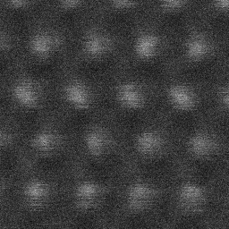 
*example noisy image*
 
This synthetic image which was created by physicists was also given.
  
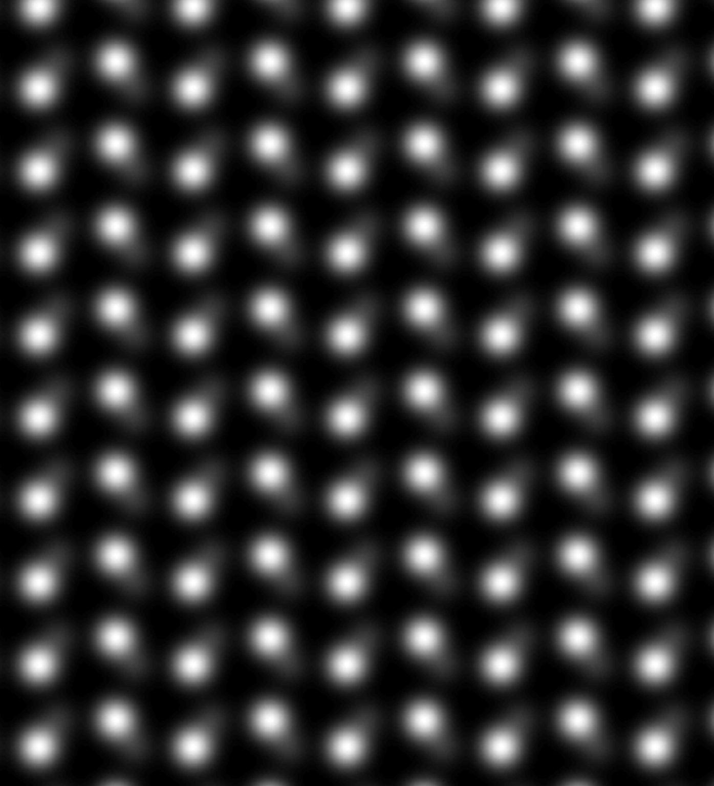 
*synthetic image*
### Accomplished Work
Our approach was to crop parts of the synthetic image that contain 
around 5x5 atoms and train a GAN Model. We also needed to rotate 
synthetic images 270° clockwise so that the pattern matches.
  
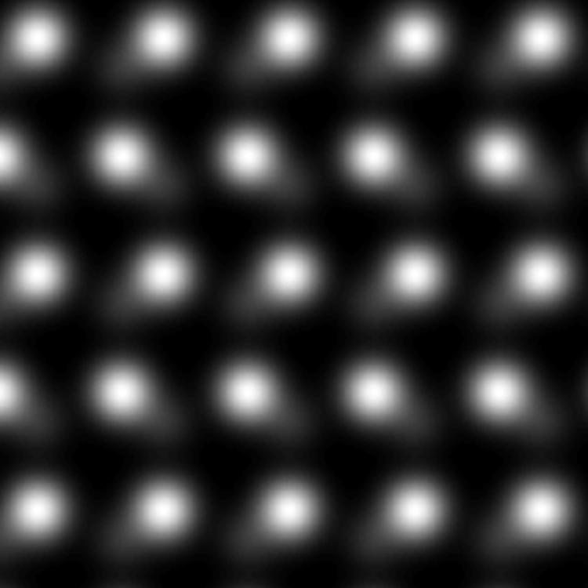 
*example crop*

Since our noisy and target images are not matched we used a CycleGAN model.
Which can be found [here](https://github.com/junyanz/pytorch-CycleGAN-and-pix2pix).

The results were satisfactory for images that contain a certain number of atoms. 
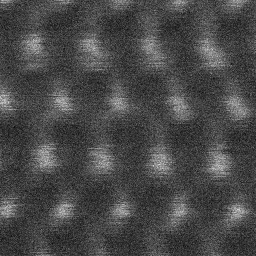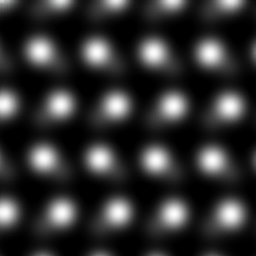 
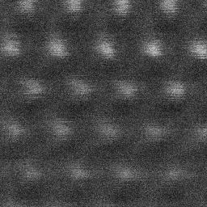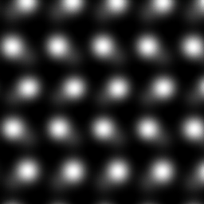 
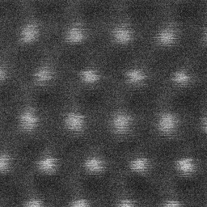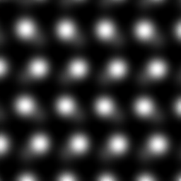 
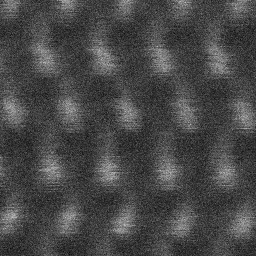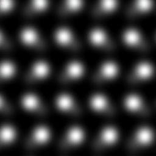 

The GAN failed to denoise images that contain more atoms and dents.  
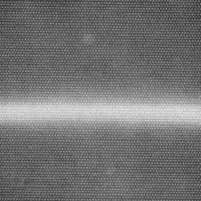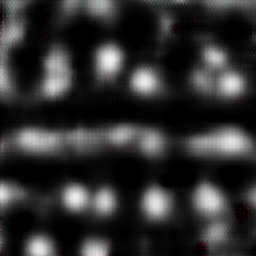 
To overcome this issue I tried to crop the image into snippets of 5x5 Atoms and denoise 
them individually and concatenate the denoised results. 
The process also removed the dent as expected since the target images used
didn't contain any dent. The order of the atoms was also distorted. 

## Second Phase: Denoising Heterogenic Images

The second type of image that we want to denoise are the 
images of the material that contain a dent. We want to avoid removing
the dent in the picture. For this purpose I generated target images that contain a dent. 
The process of creating this pictures can be summarized in a few steps. 
1. Creating Dent Masks
   1. Substract from each pixel the average pixel value.
   2. Smooth the mask by averaging each 5x5 Window.
   3. Normalizing the values to 0,255 range
   4. Setting pixels under a certain value of 128 to 0 to avoid manipulating the image outside of
   dent when we apply the mask.
   5. Apply a Gaussian Blur filter
2. Creating images with the same number of atoms
   1. I concatenated the given synthetic image to create a big image that contains hundreds of atoms
   2. I cropped images for different zoom levels so that I have images that contain for example 36x38 atoms for 20mx. We had dented images of the following zoom levels 30, 5, 10, 4, 15, 8, 12, 20
3. Applying masks to synthetic images: For each mask I took 20 synthetic images
with the corresponding zoom levels and applied the mask by adding the mask to the synthetic image.
  

| FILE               | GENERATED BY                                                                                                                                        |
|--------------------|-----------------------------------------------------------------------------------------------------------------------------------------------------|
| mask.tif           | BS3003_ADF_4MX_2446.tif - avg(BS3003_ADF_4MX_2446.tif).                                                                                             |
| mask_2.tif         | mask.tif transformed so that each pixel has the value of the neighbor with the lowest value. Neigbors are max 3 pixel away with chebyshev distance. |
| mask_3_average.tif | mask.tif transformed so that each pixel has the average value of its neighbors which are max 5 pixels away. Again with chebyshev distance.          | 

Since the process of creating masks would work better on images where there is more contrast between
the dent and the rest of the image, I used only a subset of images in this approach. 

The images used:
- BS3003 _ADF _10MX _2442.tif 
- BS3003 _ADF _10MX _2458.tif
- BS3003 _ADF _10MX _2459.tif
- BS3003 _ADF _12MX _2433.tif
- BS3003 _ADF _15MX _2443.tif
- BS3003 _ADF _15MX _2444.tif
- BS3003 _ADF _15MX _2460.tif
- BS3003 _ADF _20MX _2435.tif
- BS3003 _ADF _20MX _2436.tif
- BS3003 _ADF _20MX _2445.tif
- BS3003 _ADF _4MX _2446.tif
- BS3003 _ADF _5MX _2457.tif
- BS3003 _ADF _5MX _2461.tif
- BS3003 _ADF _8MX _2467.tif
- BS3003 _ADF _8MX _2468.tif
- BS3003 _ADF _8MX _2469.tif
- BS3003 _ADF _8MX _2471.tif
  
Example of original image, mask and created target image:
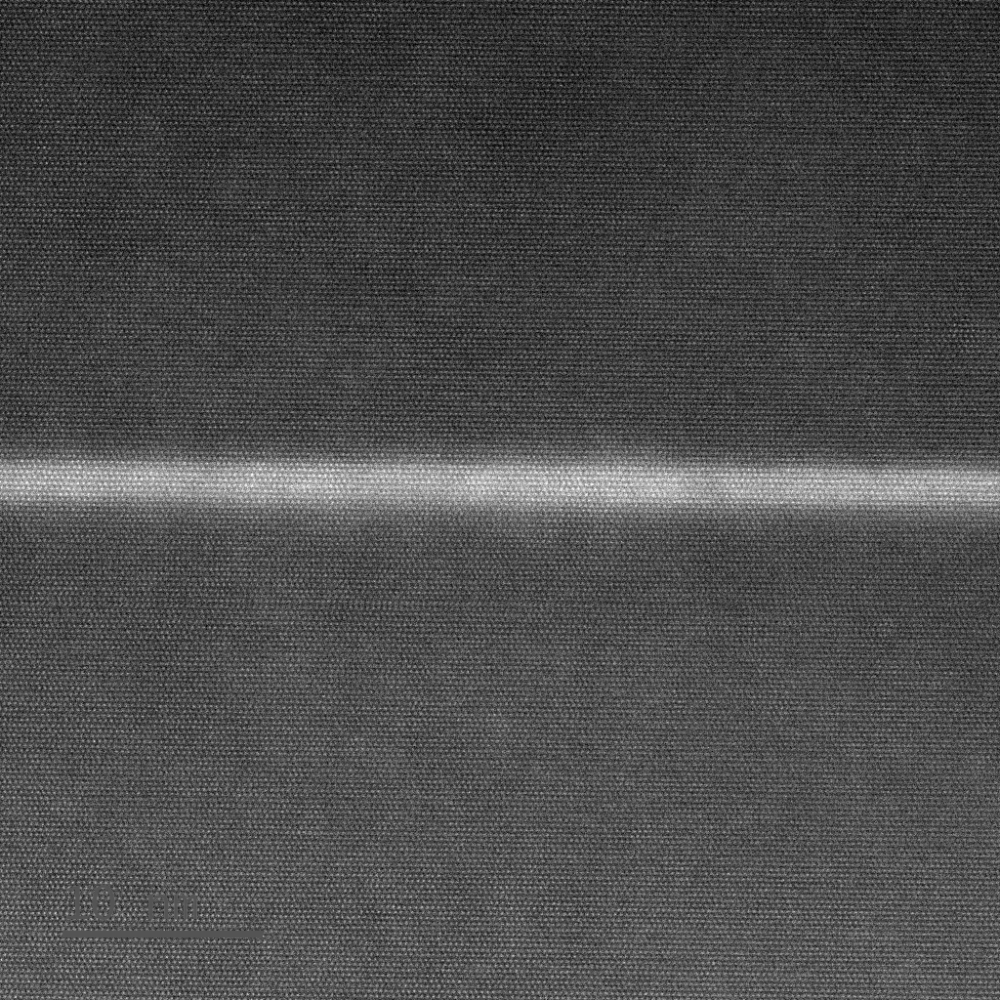

  
After training the same CycleGAN model on this dataset the network was tested on a single dented noisy image (BS3003 _ADF _10MX _2434).
 

  
The result is dissatisfactory since the single atoms are not visible in the image that is supposed to be denoised. The also didn't stay 100% the same.
 
My reasoning of this failure is that the network 
wasn't able to learn the noise pattern since the 
images do not contain the same number of atoms and the 17 dented images in the training 
dataset are too few to represent the huge number of possible dents.

 